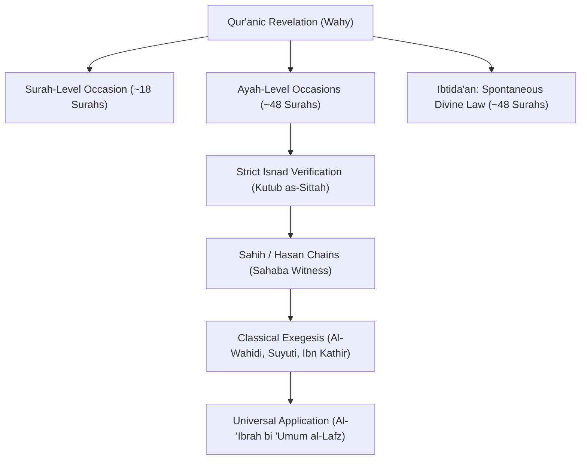

# Project Asbab Nuzul — Scholarly Dossier Volume 1
## Surahs 01 to 10 (Al-Fatihah to Yunus)

---

### Methodological Creed & Epistemic Standard
In accordance with the **Huurs Studio Campaign Orchestration Specification** and classical Sunni *Usul al-Tafsir* (Ibn Taymiyyah, Al-Zarkashi, Al-Suyuti):
1. **Divine Guidance Precedes Historical Events:** Revelation was not dependent upon earthly accidents. The majority of the Qur'an was revealed *Ibtida'an* (spontaneously as timeless divine guidance).
2. **Strict Transmission Authentication:** An occasion of revelation (*Sabab an-Nuzul*) is only accepted if narrated with a sound chain (*Isnad Sahih* or *Hasan*) from an eyewitness Companion (*Sahabi*) who explicitly testified: *"This verse was revealed concerning..."*
3. **Rejection of Speculative Folklore:** Unsubstantiated late biographical lore, Isra'iliyyat, and weak/fabricated narrations are systematically excluded.
4. **Universal Application:** The rule of *Al-'Ibratu bi 'umumi al-lafz* dictates that although a verse descended for a specific person or crisis, its moral, legal, and spiritual reality applies universally to all believers until the Day of Resurrection.

---

---

## 1. Surah Al-Fatihah (الفاتحة) — The Opening

- **Classification:** Makki (Early Liturgical Inception)
- **Asbab Status:** Ayah-Level / Liturgical Inception
- **Status Label:** Liturgical Inception of the Halved Prayer
- **Reporting Sahabah:** Abu Hurairah, Ali ibn Abi Talib, Ubayy ibn Ka'b

### Historical & Theological Context
Revealed in Mecca at the very inception of mandatory ritual prayer (*Salah*). While early portions of the revelation descended without ritual accompaniment, the institutionalization of daily communion required an opening liturgy that establishes direct dialogue between the Servant and the Divine Creator. 

### Canonical Hadith Citations
1. **Sahih Muslim 395 (Hadith Qudsi of the Halved Prayer):**
   > Narrated Abu Hurairah that the Prophet ﷺ said:  
   > *Allah the Exalted said: "I have divided the prayer between Myself and My servant into two halves, and My servant shall have what he asked for. When the servant says: 'All praise is due to Allah, the Lord of all creation,' Allah says: 'My servant has praised Me...' When he says: 'Guide us to the Straight Path,' Allah says: 'This is for My servant, and My servant shall have what he has asked for.'"*  
   > *(Sahih Muslim, Book 4, Hadith 395)*
2. **Sunan an-Nasa'i 909 & Sunan Abi Dawud 821:**
   Transmission of Ubayy ibn Ka'b confirming the Prophet ﷺ declaring Al-Fatihah as *Umm al-Qur'an* and *As-Sab' al-Mathani* revealed as an unparalleled light.
3. **Al-Wahidi, *Asbab an-Nuzul*, p. 11:**
   Ali ibn Abi Talib reported that whenever the Messenger of Allah ﷺ went forth into the open mountain passes of Mecca, he heard a calling voice: *"O Muhammad!"* When he answered, the Angel Gabriel said: *"Say: Bismi-llahi ar-Rahmani ar-Rahim. Al-hamdu lillahi Rabbi al-'alameen..."* until the completion of the Surah.

### Exegetical Synthesis & Maxim
Al-Fatihah was revealed as the permanent covenantal prayer formula. It possesses no situational crisis-trigger, but rather an ontological liturgical cause: the eternal protocol through which creation addresses the Sovereign.

---

## 2. Surah Al-Baqarah (البقرة) — The Cow

- **Classification:** Madani
- **Asbab Status:** Ayah-Level Compound (Over 40 Distinct Verified Occasions)
- **Status Label:** Compound Constitutional Charters
- **Reporting Sahabah:** Al-Bara' ibn 'Azib, Abdullah ibn Abbas, Abdullah ibn Mas'ud, Salamah ibn al-Akwa'

### Historical & Theological Context
Spanning the entire Medinan epoch (from 1 AH through the final months of Prophetic life), Surah Al-Baqarah responded progressively to the unfolding geopolitical, economic, and legislative crises of the nascent Muslim commonwealth.

### Key Verified Historical Triggers & Canonical Sources

#### A. The Shift of the Qiblah (Verses 142–150)
- **Primary Source:** **Sahih al-Bukhari 40 & Sahih Muslim 525**
- **Narrator:** Al-Bara' ibn 'Azib
- **Trigger:** The Prophet ﷺ prayed towards Bayt al-Maqdis (Jerusalem) for sixteen or seventeen months following the Hijrah, while his heart yearned towards the Ka'bah built by Ibrahim. The Jewish tribes questioned this adherence. Allah revealed:  
  *«We have certainly seen the turning of your face toward the heaven, and We will surely turn you to a qiblah with which you will be pleased...»* (Baqarah: 144).

#### B. The Statutes of Ramadan Fasting (Verses 183–187)
- **Primary Source:** **Sahih al-Bukhari 4512 & Sunan Abi Dawud 2314**
- **Narrators:** Salamah ibn al-Akwa' and Al-Bara' ibn 'Azib
- **Trigger:** Initially, fasting on the Day of Ashura was voluntary, and upon the prescription of Ramadan, believers who found fasting arduous were permitted to pay *Fidyah*. Later, verse 185 revoked the concession for able individuals (*Faman shahida minkumu ash-shahra falyasumhu*). Furthermore, eating and marital relations were initially forbidden once a person slept after sunset; after a companion collapsed from exhaustion while working his date grove, verse 187 was revealed lifting the nocturnal restriction.

#### C. The Prohibition of Riba / Usury (Verses 275–281)
- **Primary Source:** **Sahih al-Bukhari 4541 & Sunan an-Nasa'i 3998**
- **Narrator:** Abdullah ibn Abbas
- **Trigger:** Revealed during the final months of the Prophet's life to dismantle pre-Islamic usurious debts contracted by Banu Thaqif and Banu Makhzum, culminating in the warning of cosmic war from Allah and His Messenger against predatory lenders.

#### D. The Night Journey Revelation of the Concluding Verses (Verses 285–286)
- **Primary Source:** **Sahih Muslim 125 & Sahih al-Bukhari 5009**
- **Narrator:** Abdullah ibn Mas'ud
- **Trigger:** Transmitted during the celestial ascent (*Al-Mi'raj*), relieving the believers of involuntary psychological whispers after they feared accountability for innermost passing thoughts (*Wa in tubdoo ma fee anfusikum aw tukhfoohu yuhasibkum bihi Allah*). Allah confirmed: *«Allah does not burden a soul beyond that it can bear.»*

---

## 3. Surah Ali-Imran (آل عمران) — The Family of Imran

- **Classification:** Madani
- **Asbab Status:** Ayah-Level Compound (Two Dominant Epics)
- **Status Label:** Compound (Delegation of Najran & Battle of Uhud)
- **Reporting Sahabah:** Abdullah ibn Abbas, Hudhayfah ibn al-Yaman, Anas ibn Malik

### Historical & Theological Context
Ali-Imran is structured around two massive historical trials: the intellectual/theological contest with the 60-member Christian delegation from Najran (Year 9–10 AH), and the military, psychological, and existential trauma of the Battle of Uhud (Shawwal 3 AH).

### Key Verified Historical Triggers & Canonical Sources

#### A. The Delegation of Najran & Ayat al-Mubahalah (Verses 1–80, specifically 59–61)
- **Primary Source:** **Sahih al-Bukhari 4380, 4381 & Sahih Muslim 2420**
- **Narrators:** Hudhayfah ibn al-Yaman and Sa'd ibn Abi Waqqas
- **Trigger:** The leaders of the Christian community of Najran (Al-'Aqib and As-Sayyid) debated the nature of Jesus with the Prophet ﷺ in his mosque in Medina. Verses 59–61 were revealed establishing:  
  *«Indeed, the example of Jesus to Allah is like that of Adam. He created him from dust; then He said to him, "Be," and he was...»*  
  When they persisted in excess, the Prophet was commanded to challenge them to *Mubahalah* (mutual invocation of Allah's curse on the untruthful). Recognizing his Prophetic station, the leaders declined the trial and accepted a peace treaty.

#### B. The Battle of Uhud: Post-Mortem & Spiritual Consolidation (Verses 121–180)
- **Primary Source:** **Sahih al-Bukhari 4066 & Sahih Muslim 1799**
- **Narrators:** Anas ibn Malik and Al-Bara' ibn 'Azib
- **Trigger:** Following the violation of orders by the archers on Mount Rumah, the martyrdom of 70 companions (including Hamzah ibn Abd al-Muttalib), and the wounding of the Prophet's face, profound grief and panic gripped Medina. Rumors that the Prophet had been killed shook the nascent community. Allah revealed:  
  *«Muhammad is not but a messenger. [Other] messengers have passed on before him. So if he was to die or be killed, would you turn back on your heels?»* (Verse 144), followed by the descent of the serene slumber (*Nu'asan yamunnu ta'ifatan minkum*) calming the steadfast.

---

## 4. Surah An-Nisa (النساء) — Women

- **Classification:** Madani
- **Asbab Status:** Ayah-Level Compound
- **Status Label:** Post-Uhud Legal & Humanitarian Charters
- **Reporting Sahabah:** 'A'ishah bint Abi Bakr, Jabir ibn Abdillah, Abdullah ibn Abbas

### Historical & Theological Context
Revealed in the aftermath of Uhud, when seventy Muslim households suddenly lost their male breadwinners. An-Nisa established groundbreaking legal charters protecting female orphans, codifying mandatory inheritance percentages for women, regulating marital equity, and providing civil guidelines for wartime treaties and judicial impartiality.

### Key Verified Historical Triggers & Canonical Sources

#### A. Protection of Orphan Girls from Predatory Guardians (Verses 2–3, 127)
- **Primary Source:** **Sahih al-Bukhari 4574 & Sahih Muslim 3018**
- **Narrator:** 'A'ishah bint Abi Bakr
- **Trigger:** Guardians would retain orphaned girls possessing wealth and property, refusing to let them marry outside the clan to prevent property loss, or marrying them without offering a fair dowry. Allah revealed verse 3:  
  *«And if you fear that you will not deal justly with the orphan girls, then marry those that please you of [other] women, two or three or four. But if you fear that you will not be just, then [marry only] one...»*

#### B. The Universal Inheritance Charters (Verses 11–12, 176)
- **Primary Source:** **Sahih al-Bukhari 4577 & Sunan Abi Dawud 2891**
- **Narrators:** Jabir ibn Abdillah and Abdullah ibn Abbas
- **Trigger:** The widow of Sa'd ibn ar-Rabi' came to the Prophet ﷺ stating: *"O Messenger of Allah, these are the two daughters of Sa'd who was martyred with you at Uhud. Their uncle has seized their entire inheritance and left them with nothing."* The pre-Islamic custom excluded women and children from inheriting. The Prophet held judgment until verses 11–12 descended, mathematically defining fixed shares (*Fara'id*) for daughters, mothers, and wives, overturning centuries of patriarchal dispossession.

#### C. Tayammum & The Lost Necklace Expedition (Verse 43)
- **Primary Source:** **Sahih al-Bukhari 334 & Sahih Muslim 367**
- **Narrator:** 'A'ishah bint Abi Bakr
- **Trigger:** During an expedition in which 'A'ishah's onyx necklace was lost, the army was halted at a desert stop devoid of water. Dawn arrived without water for Wudu. Abu Bakr reproached 'A'ishah for delaying the community. Thereupon, Allah revealed the concession of dry ablution (*Tayammum*) with clean earth, prompting Usayd ibn Hudayr to exclaim: *"This is not the first blessing from you, O family of Abu Bakr!"*

---

## 5. Surah Al-Ma'idah (المائدة) — The Table Spread

- **Classification:** Madani (Final Legislative Codification)
- **Asbab Status:** Ayah-Level Compound
- **Status Label:** Compound (Farewell Pilgrimage & Treaties)
- **Reporting Sahabah:** Umar ibn al-Khattab, Abdullah ibn Abbas, Abu Hurairah

### Historical & Theological Context
Revealed predominantly between 6 AH (Treaty of Hudaybiyyah) and 10 AH (The Farewell Pilgrimage). Serving as the ultimate legislative testament of the Qur'an, it sealed the dietary laws, judicial relations with the People of the Book, ritual cleanliness, and the theological declaration of Islam's perfection.

### Key Verified Historical Triggers & Canonical Sources

#### A. The Perfection of the Deen (Verse 3)
- **Primary Source:** **Sahih al-Bukhari 45 & Sahih Muslim 3017**
- **Narrator:** Umar ibn al-Khattab
- **Trigger:** A Jewish scholar approached Umar saying: *"O Chief of the Believers, there is an ayah in your Book which you recite; had it been revealed to us, we would have taken that day as an annual festival ('Eid)."* Umar asked which ayah, and the man recited:  
  *«Today I have perfected for you your religion, completed My favor upon you, and have chosen for you Islam as your religion.»*  
  Umar replied: *"By Allah, I know the exact day and location where it descended upon the Messenger of Allah ﷺ: he was standing at Arafah on a Friday during the Farewell Pilgrimage."*

#### B. The Progressive Prohibition of Alcohol (Verse 90–91)
- **Primary Source:** **Sahih al-Bukhari 4616 & Sunan Abi Dawud 3687**
- **Narrators:** Umar ibn al-Khattab and Sa'd ibn Abi Waqqas
- **Trigger:** After early partial restrictions in Al-Baqarah (verse 219) and An-Nisa (verse 43 regarding prayer), incidents occurred where intoxicated companions engaged in tribal boasting and altered Qur'anic recitations during prayer. Umar made continuous du'a: *"O Allah, give us a decisive, final clarification regarding wine!"* Verses 90–91 descended classifying *Khamr* as an abomination of Satan's handiwork to be strictly shunned (*Fajtanibooh*). The companions instantly emptied their wine vessels into the streets of Medina.

---

## 6. Surah Al-An'am (الأنعام) — The Cattle

- **Classification:** Makki
- **Asbab Status:** Ibtida'an / Primarily Spontaneous
- **Status Label:** Cosmic Descent (Escorted by 70,000 Angels)
- **Reporting Sahabah:** Abdullah ibn Abbas, Abdullah ibn Umar, Asma' bint Yazid

### Historical & Theological Context
In stark contrast to legislative Madani chapters, Surah Al-An'am descended almost entirely all at once in Mecca by night. It possesses no specific worldly grievance or mundane situational trigger; rather, it is a cosmic, liturgical manifesto establishing pure monotheism (*Tawhid*), shattering pagan cosmology, and asserting Allah's transcendent sovereignty over creation.

### Canonical Hadith Citations
1. **Al-Mu'jam al-Kabeer of At-Tabarani (Vol. 12, p. 215) & Al-Mustadrak of Al-Hakim (2/315):**
   > Abdullah ibn Abbas narrated:  
   > *«Surah Al-An'am was revealed all at once in Mecca by night, escorted by seventy thousand angels glorifying Allah with loud tasbih, causing the earth to tremble under them.»*  
   > Al-Dhahabi and Ibn Kathir cite this classical transmission illustrating its non-contingent cosmic majesty.
2. **Musnad Ahmad 27558:**
   Asma' bint Yazid reported: *"Surah Al-An'am was revealed to the Prophet ﷺ while I was holding the reins of his camel, Al-'Adba', and the beast was nearly brought down to its knees by the sheer heaviness of the revelation."*

### Exegetical Synthesis
Al-An'am represents the prime archetype of **Category 3 (Ibtida'an)**: divine truth initiated from the celestial realm to illuminate human consciousness without dependence on earthly provocations.

---

## 7. Surah Al-A'raf (الأعراف) — The Heights

- **Classification:** Makki
- **Asbab Status:** Ayah-Level Inception
- **Status Label:** Primordial Covenant & Meccan Pagan Practices
- **Reporting Sahabah:** Abdullah ibn Abbas, Ubayy ibn Ka'b

### Historical & Theological Context
Meccan chapter setting out the epic struggle between Prophetic guidance and tyrannical arrogance across civilizations. While its vast historical narratives (Adam, Nuh, Hud, Salih, Lut, Shu'ayb, Musa) are spontaneous revelation, specific verses address pagan superstitions regarding ritual nudity during Hajj.

### Key Verified Historical Triggers & Canonical Sources

#### A. Tawaf in Nudity Rebuked (Verses 31–32)
- **Primary Source:** **Sahih Muslim 3028 & Sahih al-Bukhari 1622**
- **Narrator:** Abdullah ibn Abbas
- **Trigger:** During the Jahiliyyah, pilgrims arriving from outside Mecca (the *Hums*) were forbidden to perform Tawaf around the Ka'bah in their everyday clothes. Unless a local Qurayshi lent them garments, they stripped completely naked—men by day and women by night—claiming they would not worship Allah in clothes they had sinned in. Allah revealed:  
  *«O children of Adam, take your adornment at every masjid, and eat and drink, but be not extravagant...»* (Verse 31).

#### B. The Primordial Covenant / Alastu bi-Rabbikum (Verse 172)
- **Primary Source:** **Musnad Ahmad 2455 & Sunan at-Tirmidhi 3075**
- **Narrators:** Ubayy ibn Ka'b and Abdullah ibn Abbas
- **Trigger:** Revealed as an ontological declaration of human fitrah: the gathering of all descendants of Adam in the celestial realm prior to bodily creation, extracting the primordial witness: *"Am I not your Lord?"* to which all souls responded: *"Yes, we testify."*

---

## 8. Surah Al-Anfal (الأنفال) — The Spoils of War

- **Classification:** Madani
- **Asbab Status:** Ayah-Level Compound (The Badr Campaign Ledger)
- **Status Label:** The Divine Ledger of Badr (Ramadan 2 AH)
- **Reporting Sahabah:** Sa'd ibn Abi Waqqas, Abdullah ibn Abbas, Abu Ayyub al-Ansari

### Historical & Theological Context
Surah Al-Anfal was revealed in the direct aftermath of the miraculous Battle of Badr (17 Ramadan, 2 AH). It serves as the official divine commentary on the campaign, resolving disputes over war spoils, detailing angelic intervention, and redirecting praise solely to Allah.

### Key Verified Historical Triggers & Canonical Sources

#### A. Dispute Over the Distribution of Spoils (Verse 1)
- **Primary Source:** **Sunan Abi Dawud 2737, Jami' at-Tirmidhi 3079, Musnad Ahmad 1512**
- **Narrator:** Sa'd ibn Abi Waqqas
- **Trigger:** Following the rout of the Qurayshi army, the younger Muslim fighters who pursued the enemy claimed the spoils, while the veteran elders who guarded the Prophet's station also laid claim, and those guarding the rear claimed a share. Contention arose. Allah removed the matter entirely from human hands:  
  *«They ask you, [O Muhammad], concerning the spoils of war. Say, "The spoils belong to Allah and the Messenger. So fear Allah and adjust all matters of difference among you..."»* (Verse 1). The Prophet subsequently divided the goods with absolute equity.

#### B. Angelic Reinforcements & The Dust Thrown (Verses 9, 17)
- **Primary Source:** **Sahih Muslim 1763 & Sahih al-Bukhari 3953**
- **Narrators:** Umar ibn al-Khattab and Abdullah ibn Abbas
- **Trigger:** When the Prophet looked at the 313 ill-equipped Muslims facing 1,000 armored Quraysh, he faced the Qiblah, raised his hands until his cloak fell, supplicating: *"O Allah, if this small band is destroyed, You will not be worshipped on this earth!"* Verse 9 descended promising 1,000 successive angels (*bi-alfin mina al-mala'ikati murdifeen*). Later, when the Prophet hurled a handful of pebbles at the opposing ranks blinding their vision, verse 17 affirmed: *«And you threw not, [O Muhammad], when you threw, but it was Allah who threw.»*

---

## 9. Surah At-Tawbah (التوبة) — The Repentance

- **Classification:** Madani (Final Medinan Epoch)
- **Asbab Status:** Ayah-Level Compound
- **Status Label:** The Ultimatum & Tabuk Campaign Ledger (Rajab 9 AH)
- **Reporting Sahabah:** Ka'b ibn Malik, Abu Hurairah, Abdullah ibn Abbas, Zayd ibn Thabit

### Historical & Theological Context
Revealed in 9 AH, At-Tawbah contains no opening *Basmalah* because it represents a solemn judicial ultimatum (*Bara'ah*) dissolving treaties with polytheists who repeatedly betrayed pacts, unmasking the Medinan hypocrites (*Munafiqoon*), and addressing the grueling Expedition of Tabuk during extreme drought and heat.

### Key Verified Historical Triggers & Canonical Sources

#### A. Unmasking the Demolition Mosque / Masjid al-Dirar (Verses 107–108)
- **Primary Source:** **Sahih al-Bukhari 4528 & Sahih Muslim 2779**
- **Narrator:** Abdullah ibn Abbas
- **Trigger:** Twelve hypocrites constructed a competing structure in Quba under the instigation of Abu 'Amir ar-Rahib, asking the Prophet ﷺ to pray in it to legitimize their center of espionage. While returning from Tabuk at Dhu Awan, verses 107–108 descended revealing its treacherous objective: *«Do not stand [for prayer] within it - ever. A mosque founded on righteousness from the first day is more worthy for you to stand in...»* The Prophet ordered it demolished.

#### B. The Three Who Remained Behind (Verse 118)
- **Primary Source:** **Sahih al-Bukhari 4418 & Sahih Muslim 2769**
- **Narrator:** Ka'b ibn Malik (Direct Personal Eyewitness Testimony)
- **Trigger:** Ka'b ibn Malik, Murarah ibn ar-Rabi', and Hilal ibn Umayyah failed to mobilize for Tabuk out of procrastination, not hypocrisy. When the Prophet returned, they refused to offer false excuses like the hypocrites, confessing truth. The Prophet ordered the community to boycott them. For fifty nights, the earth constricted around them despite its vastness (*Hatta idha daqat 'alayhimu al-ardu bima rahubat*). On the 50th dawn, verse 118 was revealed accepting their repentance, sparking universal celebration in Medina.

---

## 10. Surah Yunus (يونس) — Jonah

- **Classification:** Makki
- **Asbab Status:** Ibtida'an / Primarily Spontaneous
- **Status Label:** Primarily Spontaneous (Cosmic & Prophetic Solace)
- **Reporting Sahabah:** Abdullah ibn Abbas, Abu Hurairah

### Historical & Theological Context
Revealed during the middle Meccan period to bolster the Prophet's resolve amidst entrenched Qurayshi obstinacy. It centers upon cosmic chronometry (sun as radiance, moon as light), maritime survival, the psychological hubris of man during sea storms, and the historic uniqueness of the people of Jonah whose collective repentance averted impending ruin.

### Key Context & Exegetical Clarification
1. **Rejection of Altered Qur'an (Verse 15):**
   - **Primary Source:** Al-Wahidi (*Asbab an-Nuzul*, p. 165) citing Ibn Abbas.
   - **Occasion:** Meccan chieftains (al-Walid ibn al-Mughirah, al-'As ibn Wa'il) arrogantly demanded: *"Bring us a Qur'an other than this, or change it!"* (remove denunciations of idols and afterlife warnings).
   - **Divine Response:** *«Say, [O Muhammad], "It is not for me to change it on my own accord. I only follow what is revealed to me. Indeed I fear, if I should disobey my Lord, the punishment of a tremendous Day."»*
2. **The Beatific Vision / Ziyadah (Verse 26):**
   - **Primary Source:** **Sahih Muslim 181** (Transmission of Suhayb ar-Rumi)
   - The Prophet recited: *«For them who have done good is the best reward and extra (ziyadah)...»* and explained that when the people of Paradise enter Paradise, the veil is lifted, and they are granted nothing more beloved than gazing upon their Lord.

---

### Methodological Summary Table: Surahs 01–10

| Surah | Name | Classification | Asbab Status | Primary Occasion / Trigger | Canonical Hadith Citations |
|---|---|---|---|---|---|
| **01** | **Al-Fatihah** | Makki | Ayah-Level | Inception of Mandatory Salah; Halved Prayer | Sahih Muslim 395, Sunan an-Nasa'i 909 |
| **02** | **Al-Baqarah** | Madani | Ayah-Level (Compound) | Qiblah shift, Ramadan fasting, Usury ban | Sahih al-Bukhari 40, 4512, 4541; Muslim 125 |
| **03** | **Ali-Imran** | Madani | Ayah-Level (Compound) | Delegation of Najran & Battle of Uhud | Sahih al-Bukhari 4380, 4066; Muslim 2420 |
| **04** | **An-Nisa** | Madani | Ayah-Level (Compound) | Orphan protection, Inheritance, Tayammum | Sahih al-Bukhari 4574, 4577, 334; Muslim 1748 |
| **05** | **Al-Ma'idah** | Madani | Ayah-Level (Compound) | Completion of Deen, Khamr prohibition | Sahih al-Bukhari 45, 4616; Muslim 3017 |
| **06** | **Al-An'am** | Makki | **Ibtida'an** | Descended at night with 70,000 angels | Tabarani (Kabeer 12/215), Hakim (2/315) |
| **07** | **Al-A'raf** | Makki | Ayah-Level | Nude Tawaf prohibited; Primordial Covenant | Sahih Muslim 3028, Musnad Ahmad 2455 |
| **08** | **Al-Anfal** | Madani | Ayah-Level (Compound) | Badr spoils, Angelic aid, Hurling pebbles | Sahih al-Bukhari 3953, Muslim 1763, Dawud 2737 |
| **09** | **At-Tawbah** | Madani | Ayah-Level (Compound) | Demolition Mosque, Ka'b ibn Malik's Repentance | Sahih al-Bukhari 4418, 4528; Muslim 2769 |
| **10** | **Yunus** | Makki | **Ibtida'an** | Pagan demand for altered text; Beatific Vision | Sahih Muslim 181, Al-Wahidi p. 165 |

---
*Verified and archived under Project Asbab Nuzul standards. No speculative late traditions admitted.*
