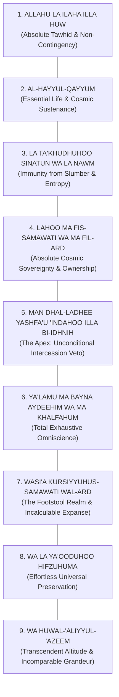

# The Supreme Throne Verse (Ayat al-Kursi)
## Classical Sunni Exegetical Synthesis & Concentric Architecture

> *اللَّهُ لَا إِلَٰهَ إِلَّا هُوَ الْحَيُّ الْقَيُّومُ ۚ لَا تَأْخُذُهُ سِنَةٌ وَلَا نَوْمٌ ۚ لَهُ مَا فِي السَّمَاوَاتِ وَمَا فِي الْأَرْضِ ۚ مَنْ ذَا الَّذِي يَشْفَعُ عِنْدَهُ إِلَّا بِإِذْنِهِ ۚ يَعْلَمُ مَا بَيْنَ أَيْدِيهِمْ وَمَا خَلْفَهُمْ ۖ وَلَا يُحِيطُونَ بِشَيْءٍ مِنْ عِلْمِهِ إِلَّا بِمَا شَاءَ ۚ وَسِعَ كُرْسِيُّهُ السَّمَاوَاتِ وَالْأَرْضَ ۖ وَلَا يَئُودُهُ حِفْظُهُمَا ۚ وَهُوَ الْعَلِيُّ الْعَظِيمُ*

---

## 1. Classical Sound Prophetic Accreditation & Rank

In the orthodox Sunni tradition, **Ayat al-Kursi** is unanimously recognized as the single greatest verse in the entire revelation of the Qur'an. This status is not based on speculative preference, but upon definitive, authentic prophetic declarations:

### A. The Direct Inquiry of Ubayy ibn Ka'b (The Greatest Ayah)
- **Source:** *Sahih Muslim* (Hadith 810), *Sunan Abi Dawud* (Hadith 1460), *Musnad Ahmad* (Hadith 21190).
- **Text & Isnad:** The Messenger of Allah (peace be upon him) asked Ubayy ibn Ka'b—the chief of Qur'anic reciters among the Companions:  
  *«O Abu al-Mundhir! Do you know which verse from the Book of Allah in your memory is the greatest?»*  
  Ubayy answered: *«Allahu la ilaha illa Huwa al-Hayyul-Qayyum.»*  
  The Prophet struck his chest with his hand in joy and exclaimed:  
  *«May knowledge be easy and delightful for you, O Abu al-Mundhir! By Him in Whose Hand is my soul, it has a tongue and two lips that sanctify the Sovereign King at the foot of the Throne!»*
- **Scholarly Finding (Al-Nawawi, *Sharh Sahih Muslim* 6/93):** The verse was designated the greatest because it is an undiluted synthesis of the essential foundations of Tawhid (Divine Unity), encompassing divine self-existence, absolute life, eternal vigilance, cosmic ownership, flawless knowledge, limitless realm, and effortless preservation.

### B. The Nocturnal Encounter of Abu Hurairah (The Angelic Guardian & Shield)
- **Source:** *Sahih al-Bukhari* (Hadith 2311, 3275, 5010).
- **Authentic Narration:** When Abu Hurairah was appointed to guard the Zakat al-Fitr dates, a nighttime thief returned three nights in succession. Upon being threatened with the Messenger of Allah, the intruder pleaded:  
  *«Whenever you go to bed, recite Ayat al-Kursi from start to finish. If you do so, a guardian from Allah will remain assigned over you continuously, and no devil will be able to approach you until dawn.»*  
  When reported to the Prophet (peace be upon him), he declared:  
  *«He told you the truth, though he is a habitual liar. That was Satan himself.»*

### C. The Post-Prayer Guarantee of Abu Umamah (The Portal to Paradise)
- **Source:** *Sunan an-Nasa'i al-Kubra* (Hadith 9848), *Amal al-Yawm wal-Laylah* (Hadith 100), *Mu'jam al-Kabeer* (Al-Tabarani, 8/346). Authenticated by Al-Mundhiri in *Al-Targhib wat-Tarhib*, Ibn Hibban, and Al-Albani in *Silsilah al-Ahadith al-Sahihah* (Hadith 972).
- **Authentic Hadith:** The Prophet (peace be upon him) said:  
  *«Whoever recites Ayat al-Kursi immediately after every obligatory prescribed prayer, nothing stands between him and entering Paradise except death.»*
- **Theological Significance (Ibn al-Qayyim, *Zad al-Ma'ad* 1/305):** Sustained recitation connects the ritual conclusion of prayer (*Salah*) to continuous mindfulness of the living, self-subsisting Creator, purifying the heart of reliance upon secondary causes.

---

## 2. Clause-by-Clause Exegetical Analysis (The 9 Pillars of Majesty)

Ayat al-Kursi consists of nine harmonious, grammatically interlocking clauses. Classical commentators identify in them the complete refutation of all polytheistic, deistic, and anthropomorphic heresies:



### Clause 1: *Allāhu lā ilāha illā Hū* (The Declaration of Absolute Monotheism)
- **Linguistic Analysis:** *Allāh* is the proper name (*al-Ism al-A'lam*) denoting the uniquely adored Lord. The construction *lā ilāha illā Hū* uses complete negation (*Nafy*) of any rightful deity, followed by rigorous exception (*Ithbāt*) exclusively for Him.
- **Tafsir Consensus (Al-Tabari, *Jami' al-Bayan* 5/386):** There is no creator, master, or object of servitude deserving of devotion except Him alone. All claimed gods are empty fabrications.
- **Doctrinal Implication:** Demolishes polytheism (*Shirk*) at its foundation.

### Clause 2: *Al-Ḥayyul-Qayyūm* (The Living, The Self-Subsisting Sustainer)
- **Linguistic Analysis:** 
  - *Al-Ḥayy* (The Ever-Living): Divine life is unoriginated, perpetual, and absolute, free from beginning, end, deficiency, or biological dependency.
  - *Al-Qayyūm* (The Self-Sustaining Sustainer): Intensive form (*Fa''ūl* / *Fay'ūl*) from the root *Q-W-M*. He who exists independently of all creation, while all existing things depend entirely upon Him for their inception and continuation.
- **Scholarly Insight (Fakhr al-Din al-Razi, *Mafatih al-Ghayb* 7/4):** These two divine names represent the twin pillars of all Divine Names (*Asma'ullah*). *Al-Hayy* summarizes all Attributes of the Divine Essence (*Sifat al-Dhat*), while *Al-Qayyum* summarizes all Attributes of Divine Action (*Sifat al-Fi'l*).
- **The Greatest Name (*Ismullah al-A'zam*):** Multiple sound traditions indicate that Allah's Greatest Name is found in this clause and in the opening of Surah Ali 'Imran (*Al-Hayyul-Qayyum*).

### Clause 3: *Lā ta'khudhuhū sinatun wa lā nawm* (Immunity from Drowsiness and Sleep)
- **Linguistic Analysis:** *Sinah* is the initial heaviness of eyelids and head before deep slumber (drowsiness/slumber); *Nawm* is complete unconscious sleep.
- **Tafsir Consensus (Ibn Kathir, 1/772):** Sleep is a biological deficiency caused by physical exhaustion, brain fatigue, and entropy. Because Allah is the eternal *Qayyum*, drowsiness or slumber cannot seize Him (*Lā ta'khudhuhū*). If slumber were to touch the Sustainer for a fraction of a second, the celestial equilibrium of the galaxies would collapse into annihilation.
- **Refutation of Anthropomorphism:** Explicitly refutes the biblical myth that the Creator rested on the seventh day.

### Clause 4: *Lahū mā fis-samāwāti wa mā fil-arḍ* (Sovereign Ownership of All Realms)
- **Linguistic Analysis:** The prepositional phrase *Lahū* (To Him alone belongs) is brought forward (*Taqdim al-Haqq*), establishing exclusive ownership and jurisdiction (*Hasr*).
- **Tafsir Consensus (Al-Qurtubi, 3/272):** Every entity inhabiting the celestial heavens and terrestrial spheres—angels, humans, jinn, stars, planets, and atoms—is a created servant and absolute chattel under His uncontested ownership.
- **Ethical Implication:** Human ownership of property is mere temporary stewardship (*Istikhlaf*); absolute title belongs to Allah.

### Clause 5: *Man dhal-ladhī yashfa‘u ‘indahū illā bi-idhnih* (The Apex: Sovereign Permission for Intercession)
- **Linguistic Analysis:** Interrogative form (*Istifham Inkari*) carrying the force of absolute denial: "Who could possibly dare?!"
- **Tafsir Consensus (Ibn Kathir, 1/773; Al-Tabari, 5/392):** No one—regardless of rank, whether archangel Jibril or the Master of Messengers Muhammad (peace be upon him)—can initiate intercession (*Shafa'ah*) on the Day of Reckoning except after receiving explicit divine permission and pleasure.
- **Refutation of Pagan Rationalization:** Pre-Islamic Arabs claimed their idols were intermediaries (*Shufa'a'*). This clause establishes that intercession is a gift granted by the King, not a leverage exerted upon Him.

### Clause 6: *Ya‘lamu mā bayna aydīhim wa mā khalfahum* (Exhaustive Omniscience across Time)
- **Linguistic Analysis:** *Mā bayna aydīhim* (what is before them / future / worldly presence) and *mā khalfahum* (what is behind them / past / hereafter).
- **Tafsir Consensus (Mujahid, Al-Dahhak, Ibn Abbas):** His knowledge encompasses all spatial dimensions and temporal timelines. Nothing escapes His sight: from the movements of galaxies to the unspoken thoughts hidden in human chests.
- **Clause Parallel:** *Wa lā yuḥīṭūna bi-shay'im-min ‘ilmihī illā bimā shā'*: Creation possesses zero autonomous insight; whatever mathematics, science, or wisdom humanity acquires is a microscopic drip imparted by divine will.

### Clause 7: *Wasi‘a kursiyyuhus-samāwāti wal-arḍ* (The Incalculable Expanse of the Kursi)
- **Authentic Cosmological Metric (Ibn Abbas & Abu Dharr in Al-Bayhaqi, Ibn Abi Shaybah, and Al-Tabarani; authenticated by Al-Albani in *Al-Sahihah* 109):**  
  *«The seven heavens and the seven earths in relation to the Kursi are nothing but like a small iron ring thrown into a boundless desert! And the Kursi in relation to the Supreme Throne ('Arsh) is likewise like a small ring thrown into a boundless desert!»*
- **Tafsir Analysis (Ibn Abbas, Ibn Kathir, Al-Tabari):** The *Kursi* is the Footstool of the Sovereign Lord, positioned beneath the *'Arsh* (Throne). The observable physical universe, containing hundreds of billions of galaxies, is completely dwarfed by the single realm of the Kursi.
- **Cognitive Impact:** Utterly dissolves human self-importance and anthropocentrism.

### Clause 8: *Wa lā ya'ūduhū ḥifẓuhumā* (Effortless Universal Preservation)
- **Linguistic Analysis:** *Ya'ūdu* derives from *A-W-D*, meaning to burden, weigh down, oppress, or fatigue.
- **Tafsir Consensus (Al-Tabari, 5/395; Al-Qurtubi, 3/278):** Managing every atom, orbit, biological cell, and galactic trajectory across the universe does not impose the slightest weight, strain, or weariness upon Allah.
- **Cosmic Comfort:** If holding galaxies in equilibrium exhausts zero divine effort, sustaining the believer's personal trials is utterly effortless for Him.

### Clause 9: *Wa Huwal-‘Aliyyul-‘Aẓīm* (The Transcendent Most High, The Supreme Magnificent)
- **Linguistic Analysis:** 
  - *Al-'Aliyy*: Transcendent Highness in Essence (*'Uluww al-Dhat*), Status and Attributes (*'Uluww al-Sifat*), and Overcoming Sovereignty (*'Uluww al-Qahr*). High above all physical defects and residing above the Throne.
  - *Al-'Azeem*: The Supreme, Incomparably Magnificent. The attribute that inspires reverent awe (*Khashyah*), before whom all tyrants, empires, and titans are humbled into insignificance.

---

## 3. The Structural Masterpiece: 9-Clause Concentric Ring Composition

Classical rhetoric and contemporary structural analysis demonstrate that Ayat al-Kursi is structured in an immaculate concentric chiasmus (ring composition), mirroring inward toward the central truth of Divine Omniscience and Sovereign Authority:

```text
[A] Clause 1: Absolute Monotheism & Supreme Identity (Allahu la ilaha illa Huw)
  │
  [B] Clause 2: Life and Self-Sustenance (Al-Hayyul-Qayyum)
    │
    [C] Clause 3: Immunity from physical weakness & sleep (La ta'khudhuhu sinah...)
      │
      [D] Clause 4: Universal Ownership of Heavens and Earth (Lahu ma fis-samawat...)
        │
        [E] ★ Clause 5: THE SOVEREIGN CENTER — Absolute Authority over Intercession
        │               (Man dhal-ladhee yashfa'u 'indahoo illa bi-idhnih)
        │
      [D'] Clause 6: Total Omniscience over Heavens & Earth (Ya'lamu ma bayna aydeehim...)
    │
    [C'] Clause 7: Cosmic Scale & Realm of the Footstool (Wasi'a Kursiyyuhu...)
  │
  [B'] Clause 8: Immunity from cosmic fatigue & preservation (Wa la ya'ooduhoo hifzuhuma)
│
[A'] Clause 9: Transcendent Highness & Grandeur (Wa Huwal-'Aliyyul-'Azeem)
```

### The Symmetrical Correspondences:
1. **Clause 1 [A] mirrors Clause 9 [A']:** Begins with Divine Uniqueness (*Tawhid*) and concludes with Transcendent Elevation and Grandeur (*Al-'Aliyy Al-'Azeem*).
2. **Clause 2 [B] mirrors Clause 8 [B']:** *Al-Qayyum* (The Sustainer) balances *Wa la ya'ooduhoo hifzuhuma* (The effortless preserver who suffers no fatigue).
3. **Clause 3 [C] mirrors Clause 7 [C']:** Internal immunity from mortal sleep (*Sinatun wa la nawm*) balances external cosmic vastness over heavens and earth (*Wasi'a Kursiyyuh*).
4. **Clause 4 [D] mirrors Clause 6 [D']:** Spatial ownership of all existence (*Lahu ma fis-samawati*) balances cognitive omniscience over all creation's past and future (*Ya'lamu ma bayna aydeehim*).
5. **Clause 5 [E] (The Pivot):** At the absolute heart stands the sovereign prerogative: **Zero intercession without His permission**, establishing that God alone holds unchallengeable, absolute jurisdiction.

---

## 4. Practical Spiritual Applications (Sunni Living Creed)

1. **Eradication of Anxiety (Anchor in *Al-Qayyum*):**  
   When human systems fail, recognizing that the universe is governed by the Ever-Living, Self-Sustaining Lord liberates the soul from panic over worldly fragility.
2. **Freedom from People-Pleasing (*Lahu ma fis-samawat*):**  
   Recognizing that all leaders, institutions, and mortals are merely fellow owned servants eliminates groveling before human power.
3. **Nightly Fortification (The Angelic Guard):**  
   Reciting Ayat al-Kursi before sleep creates a psychological and spiritual sanctuary, driving away satanic nightmares, sleep paralysis dread, and despair.
4. **Consistency after Prayer:**  
   Making it an unbroken habit after every obligatory prayer permanently links the heart to the guarantee of Paradise.
