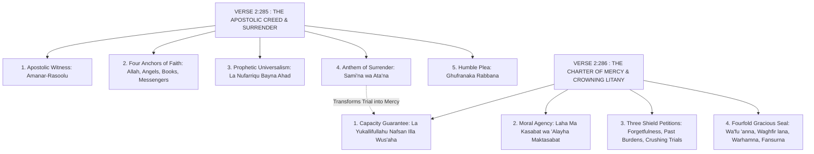

# The Apostolic Seal (The Last Two Verses: 2:285–286)
## Classical Sunni Exegetical Synthesis & Covenant Architecture

> *آمَنَ الرَّسُولُ بِمَا أُنزِلَ إِلَيْهِ مِن رَّبِّهِ وَالْمُؤْمِنُونَ ۚ كُلٌّ آمَنَ بِاللَّهِ وَمَلَائِكَتِهِ وَكُتُبِهِ وَرُسُلِهِ لَا نُفَرِّقُ بَيْنَ أَحَدٍ مِّن رُّسُلِهِ ۚ وَقَالُوا سَمِعْنَا وَأَطَعْنَا ۖ غُفْرَانَكَ رَبَّنَا وَإِلَيْكَ الْمَصِيرُ (285)*  
> *لَا يُكَلِّفُ اللَّهُ نَفْسًا إِلَّا وُسْعَهَا ۚ لَهَا مَا كَسَبَتْ وَعَلَيْهَا مَا اكْتَسَبَتْ ۗ رَبَّنَا لَا تُؤَاخِذْنَا إِن نَّسِينَا أَوْ أَخْطَأْنَا ۚ رَبَّنَا وَلَا تَحْمِلْ عَلَيْنَا إِصْرًا كَمَا حَمَلْتَهُ عَلَى الَّذِينَ مِن قَبْلِنَا ۚ رَبَّنَا وَلَا تُحَمِّلْنَا مَا لَا طَاقَةَ لَنَا بِهِ ۖ وَاعْفُ عَنَّا وَاغْفِرْ لَنَا وَارْحَمْنَا ۚ أَنتَ مَوْلَانَا فَانصُرْنَا عَلَى الْقَوْمِ الْكَافِرِينَ (286)*

---

## 1. Classical Sound Prophetic Accreditation & Cosmic Status

The final two verses of Surah Al-Baqarah occupy a unique theological status across the entire Qur'anic canon. In sound Sunni hadith collections, they are uniquely designated as a celestial gift granted directly to the Prophet Muhammad (peace be upon him) from beneath the Throne of Allah (*Tahta al-'Arsh*):

### A. The Direct Celestial Gift of the Night of Ascension (Al-Mi'raj)
- **Source:** *Sahih Muslim* (Hadith 173), *Sunan an-Nasa'i* (Hadith 451), *Musnad Ahmad* (Hadith 3881, narrated by Abdullah ibn Mas'ud).
- **Authentic Narration:**  
  *«When the Messenger of Allah (peace be upon him) was taken on the Night Journey to the Farthest Lote Tree (Sidrat al-Muntaha)... he was given three distinct honors: (1) The five daily prescribed prayers, (2) The concluding verses of Surah Al-Baqarah, and (3) Forgiveness of major sins for anyone from his Ummah who does not associate anything with Allah in worship.»*
- **Scholarly Finding (Ibn Kathir, 1/846; Ibn Hajar, *Fath al-Bari* 9/56):** Unlike the standard transmission of revelation where archangel Jibril descended to earth, these verses were communicated directly to the Prophet (peace be upon him) in the highest celestial realm, indicating their supreme, inviolable weight.

### B. The Treasury Beneath the Throne (*Kanzun Tahta al-'Arsh*)
- **Source:** *Sunan al-Tirmidhi* (Hadith 2887), *Sunan ad-Darimi* (Hadith 3390), *Musnad Ahmad* (Hadith 21574, narrated by Abu Dharr).
- **Authentic Hadith:** The Messenger of Allah (peace be upon him) said:  
  *«I was given the concluding verses of Surah Al-Baqarah from a divine treasure located beneath the Throne; they were not granted to any prophet before me.»*
- **Theological Meaning (Al-Qurtubi, 3/421):** A "treasure beneath the Throne" signifies that their spiritual realities were preserved in the highest celestial sanctuary, endowed with unprecedented blessings of protection, pardon, and victory.

### C. The Nightly Sufficiency (*Kafataah*)
- **Source:** *Sahih al-Bukhari* (Hadith 5009, 5040, 5051), *Sahih Muslim* (Hadith 807, 808, narrated by Abu Mas'ud al-Badri).
- **Authentic Hadith:** The Prophet (peace be upon him) declared:  
  *«Whoever recites the last two verses of Surah Al-Baqarah during the night, they will suffice him (Kafataah).»*
- **Scholarly Consensus on the Scope of *Kafataah* (Al-Nawawi, *Sharh Sahih Muslim* 6/91; Ibn Hajar, *Fath al-Bari* 9/56):**
  1. *Suffices him as a replacement for the voluntary night prayer (Qiyam al-Layl)* if he is exhausted.
  2. *Suffices him as an unassailable shield against every satanic harm, evil spirit, and disaster.*
  3. *Suffices him as a renewal and fortification of his faith (Iman)* through its comprehensive creedal articulation.

---

## 2. The Dramatic Occasion of Revelation (*Sabab al-Nuzul*)

The descent of these verses forms one of the most poignant psychological milestones in the history of the early Muslim community:

### The Crisis of Conscience (Terror over Verse 2:284)
- **Source:** *Sahih Muslim* (Hadith 125, narrated by Abu Hurairah).
- **Historical Narrative:** When Allah revealed the preceding verse:  
  *«To Allah belongs whatever is in the heavens and whatever is on the earth. And whether you reveal what is in your souls or conceal it, Allah will call you to account for it!»* (2:284)  
  The Companions were shattered by profound existential terror. They came to the Messenger of Allah (peace be upon him) and fell to their knees, weeping and lamenting:  
  *«O Messenger of Allah! We were tasked with righteous works that we have the strength to perform—Salah, Fasting, Jihad, and Charity. But now this verse has been revealed to you, and we cannot bear it! Our hearts harbor fleeting involuntary thoughts and whispers that we cannot control! Will we be punished for what passes through our minds?!»*

### The Prophetic Pedagogy of Surrender
The Prophet (peace be upon him) did not immediately reassure them with legal technicalities. Instead, he tested their absolute spiritual commitment:  
*«Do you wish to say what the People of the Two Scriptures said before you: 'We hear and we disobey' (Sami'na wa 'asayna)? Rather, say: 'We hear and we obey! [Grant us] Your forgiveness, our Lord, and to You is the final return!'»*  
The Companions took this command to heart. They repeated *«Sami'na wa ata'na ghufranaka Rabbana wa ilaykal-maseer»* until their tongues softened, their anxiety yielded to total surrender, and their hearts found tranquility in divine authority.

### The Merciful Divine Resolution & Abrogation
Once their surrender (*Islam*) was absolute, Allah revealed the final verse:  
*«Allah burdens no soul beyond its capacity!»* (2:286)  
This divine decree established the permanent constitutional principle: **fleeting involuntary thoughts (*Waswasah*) that are not acted upon or firmly resolved upon do not incur sin.** The unbearable dread was lifted, replaced by divine compassion.

---

## 3. Detailed Exegetical Analysis of the Final Two Verses

### Exegesis of Verse 2:285: The Apostolic Creed & Total Surrender

1. **The Apostolic Witness (*Āmanar-Rasūlu bimā unzila ilayhi mir-Rabbihī wal-mu'minūn*):**  
   - Divine vindication and certification of the Messenger. Allah Himself bears witness that Muhammad (peace be upon him) is the foremost believer in the revelation, joined in perfect unity by the collective body of believers.
2. **The Four Cardinal Anchors (*Kullun āmana billāhi wa malā'ikatihī wa kutubihī wa rusulih*):**  
   - The entire structure of Islamic creed (*Aqeedah*) synthesized in four unassailable pillars: Monotheism (Allah), Unseen Guardians (Angels), Sacred Revelation (Scriptures), and Historical Guidance (Messengers).
3. **Prophetic Universalism (*Lā nufarriqu bayna aḥadim-mir-rusulih*):**  
   - Refutes the historical sectarianism of past nations who accepted certain messengers while rejecting or killing others (e.g., accepting Moses while rejecting Jesus, or accepting Jesus while rejecting Muhammad). Islam honors all 124,000 prophets as brothers in a singular lineage of truth.
4. **The Anthem of Surrender (*Wa qālū sami‘nā wa aṭa‘nā*):**  
   - The absolute verbal contract of Islam: Hearing followed instantly by obedience. This redeemed humanity from the rebellious cry *Sami'na wa 'asayna* chronicled throughout Surah Al-Baqarah.
5. **The Plea for Grace (*Ghufrānaka Rabbanā wa ilaykal-maṣīr*):**  
   - Even in the zenith of obedience, the believer does not boast of his deeds. He immediately begs for divine forgiveness (*Ghufranaka*), conscious that human devotion can never match the majesty of the Creator, and mindful of the inevitable return (*Ilaykal-maseer*).

---

### Exegesis of Verse 2:286: The Charter of Human Capacity & The Crowning Petitions

1. **The Constitutional Guarantee of Capacity (*Lā yukallifullāhu nafsan illā wus‘ahā*):**  
   - *Wus'* in classical Arabic denotes the natural scope, ease, and capability of a person.
   - **Tafsir Consensus (Al-Tabari, 6/135; Ibn Kathir, 1/850):** Allah never mandates a duty that crushes human ability, nor does He hold a person liable for that which is beyond their reach. In times of hardship, obligations are lightened (*Rukhas*).
2. **The Principle of Individual Moral Agency (*Lahā mā kasabat wa ‘alayhā maktasabat*):**  
   - Absolute accountability: Every soul earns credit for its sincere deeds (*Kasabat*), and bears liability for its earned transgressions (*Maktasabat*—the intensified form indicating deliberate, calculated sin). There is no inherited original sin.
3. **The Divine Response: "I Have Granted It!" (*Qad Fa'alt*):**  
   - **Source:** *Sahih Muslim* (Hadith 126, narrated by Ibn Abbas).  
   - As the Prophet (peace be upon him) recited each of the following petitions, Allah responded directly: **«I have done so! (Qad fa'alt)»**:
     - *«Rabbanā lā tu'ākhidhnā in-nasīnā aw akhṭa'nā»* (Our Lord, do not take us to task if we forget or fall into unintentional error!) — **Allah replied: "I have done so!"** (Lifting liability from forgetfulness and honest mistakes).
     - *«Rabbanā wa lā taḥmil ‘alaynā iṣran kamā ḥamaltahū ‘alal-ladhīna min qablinā»* (Our Lord, lay not upon us a crushing burden like that which You laid upon nations before us!) — **Allah replied: "I have done so!"** (Abolishing the severe ritual penalties and restrictions of previous dispensations).
     - *«Rabbanā wa lā tuḥammilnā mā lā ṭāqata lanā bih»* (Our Lord, burden us not with that which we lack the strength to bear!) — **Allah replied: "I have done so!"** (Protecting the community from overwhelming trials and humiliations).
4. **The Climactic Fourfold Seal of Surah Al-Baqarah:**  
   - *Wa'fu ‘annā* (Pardon our shortcomings regarding what was between us and You),
   - *Waghfir lanā* (Forgive our transgressions regarding what was between us and Your creation),
   - *Warḥamnā* (Shower Your boundless mercy upon our future destiny),
   - *Anta Mawlānā fanṣurnā ‘alal-qawmil-kāfirīn* (You are our Sovereign Protecting Lord and Master, so grant us decisive victory over the disbelieving people!).

---

## 4. Why These Verses Are the Ultimate Showcase & Selling Point

In the curriculum of Huurs Studio, these closing verses represent the ultimate pedagogical and spiritual payoff:
1. **Resolution of the Epic:** Surah Al-Baqarah opens with the struggle between faith and doubt, surveys the pitfalls of past nations, legislates civil and criminal law, and concludes with this triumphant anthem of total peace and divine acceptance.
2. **Psychological Deliverance:** Liberates Muslims from chronic religious scrupulosity (*Waswasah*) and anxiety by confirming that Allah judges intentions and efforts, not involuntary mental fleeting thoughts.
3. **Daily Practical Fortress:** Any student or seeker who memorizes and recites these two verses every night secures an authentic, prophetic guarantee of spiritual sufficiency and peace.
