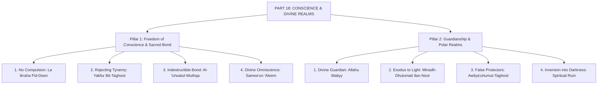
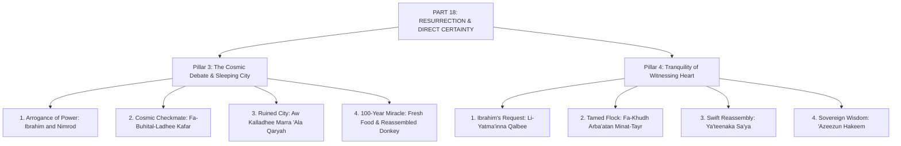
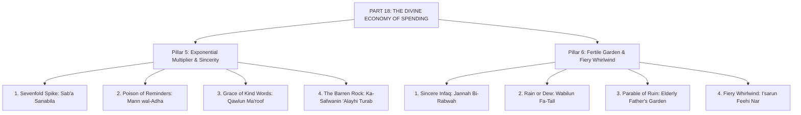
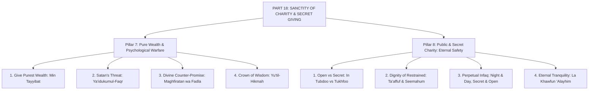

# Surah Al-Baqarah — Master Mindmap: Part 18

**Campaign:** Deeper Thought Campaign (`Deeper_thought_campaignv01`)  
**Series:** Surah Al-Baqarah  
**Designation:** Part 18  
**Foundation Media:** `thematic archives`  
**Layout Format:** 16:9 Landscape Vector PDF (792 x 480 pt) & Interactive HTML Canvas  
**Author:** AGENT-06 (Knowledge Visualization)  
**Verification:** AGENT-03 (Source Verification) & AGENT-15 (Islamic QA)  
**Status:** Canonical Release  

---

## Architecture Overview
Part 18 spans four comprehensive landscape visual sectors (8 pillars), detailing the inviolability of conscience, the polar guardians of light and darkness, empirical miracles of resurrection, and the profound social ethics of the divine economy:
- **Page 1: The Principle of Conscience & The Realms of Light**
  - *Pillar 1: Freedom of Conscience & The Sacred Bond* (No compulsion in faith, rejecting Taghoot, grasping the unbreakable handhold, and divine omniscience).
  - *Pillar 2: Guardianship & The Polar Realms* (Allah as Protecting Friend, the exodus from darkness into light, false patrons of tyranny, and descent into darkness).
- **Page 2: Parables of Resurrection & Direct Certainty**
  - *Pillar 3: The Cosmic Debate & The Sleeping City* (Ibrahim and Nimrod's solar checkmate, the ruined city of Jerusalem, and the 100-year dormant miracle).
  - *Pillar 4: Tranquility of the Witnessing Heart* (Ibrahim's plea for peace of heart, the four tamed birds, instantaneous reassembly, and almighty wisdom).
- **Page 3: The Divine Economy of Spending (Infaq)**
  - *Pillar 5: The Exponential Multiplier & Sincerity* (The 700-fold harvest, nullifying gifts through reminders and harm, kind speech over insult, and the scoured barren rock).
  - *Pillar 6: The Fertile Garden & The Fiery Whirlwind* (The garden on high ground, heavy rain versus gentle dew, the vulnerable elderly father, and the incinerated estate).
- **Page 4: Sanctity of Charity, Fear & Secret Giving**
  - *Pillar 7: Pure Wealth & Psychological Warfare* (Giving from the finest earnings, Satan's threat of poverty, Allah's promise of forgiveness and bounty, and the crown of wisdom).
  - *Pillar 8: Public & Secret Charity: Eternal Safety* (Open versus concealed giving, the dignity of the restrained, day-and-night philanthropy, and eternal tranquility).

---

## Detailed Visual Node Breakdown

### PAGE 1 : THE PRINCIPLE OF CONSCIENCE & THE REALMS OF LIGHT

### PAGE 2 : PARABLES OF RESURRECTION & DIRECT CERTAINTY

### PAGE 3 : THE DIVINE ECONOMY OF SPENDING (INFAQ)

### PAGE 4 : SANCTITY OF CHARITY, FEAR & SECRET GIVING

