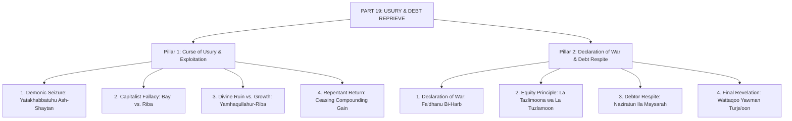
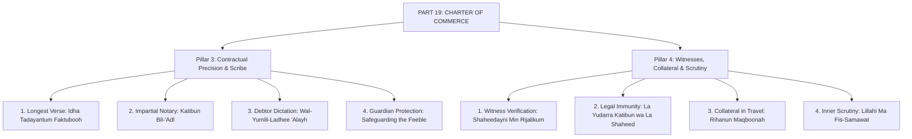
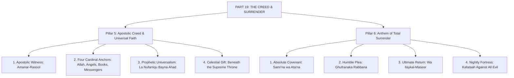
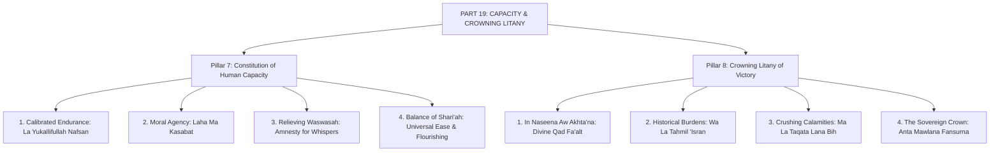

# Surah Al-Baqarah — Master Mindmap: Part 19

**Campaign:** Deeper Thought Campaign (`Deeper_thought_campaignv01`)  
**Series:** Surah Al-Baqarah  
**Designation:** Part 19 (CROWNING CONCLUSION)  
**Foundation Media:** `thematic archives`  
**Layout Format:** 16:9 Landscape Vector PDF (792 x 480 pt) & Interactive HTML Canvas  
**Author:** AGENT-06 (Knowledge Visualization)  
**Verification:** AGENT-03 (Source Verification) & AGENT-15 (Islamic QA)  
**Status:** Canonical Release  
**Special Dedication:** Pages 3 & 4 are dedicated 100% exclusively to the Last Two Verses (2:285–286).  

---

## Architecture Overview
Part 19 forms the crowning grand finale of Surah Al-Baqarah across four widescreen landscape sectors (8 pillars):
- **Page 1: The Cataclysm of Usury & The Debt Reprieve**
  - *Pillar 1: The Curse of Usury & Exploitation* (The demonic seizure, commerce vs. usury, divine blight vs. charity growth, and the repentant return).
  - *Pillar 2: Declaration of War & Debt Respite* (Declaration of cosmic war, principle of equity, granting respite to distressed debtors, and the final revealed ayah).
- **Page 2: The Charter of Commerce: Ayat al-Dayn**
  - *Pillar 3: Contractual Precision & The Scribe* (The longest verse, institutional documentation, the impartial notary, debtor dictation, and guardian protection).
  - *Pillar 4: Witnesses, Collateral & Divine Scrutiny* (Robust witness verification, inviolability of scribes and witnesses, travel collateral, and divine surveillance of hidden thoughts).
- **Page 3: The Last Two Verses (I) : The Apostolic Creed & Surrender**
  - *Pillar 5: The Apostolic Creed & Universal Faith* (Amanar-Rasool, the four cardinal anchors, prophetic universalism without distinction, and celestial provenance beneath the Throne).
  - *Pillar 6: The Anthem of Total Surrender* (Sami'na wa ata'na, the plea for grace Ghufranaka, the final destination, and the nightly fortress Kafataah).
- **Page 4: The Last Two Verses (II) : Capacity & The Crowning Litany**
  - *Pillar 7: The Constitution of Human Capacity* (Calibrated endurance La yukallifullah, pure moral agency, relief from inner waswasah, and the golden balance of the Shari'ah).
  - *Pillar 8: The Crowning Litany of Victory* (Amnesty for forgetfulness, relief from historical burdens, protection from crushing trials, and the climactic seal Anta Mawlana fansurna).

---

## Detailed Visual Node Breakdown

### PAGE 1 : THE CATACLYSM OF USURY & THE DEBT REPRIEVE

### PAGE 2 : THE CHARTER OF COMMERCE: AYAT AL-DAYN

### PAGE 3 : THE LAST TWO VERSES (I) : THE APOSTOLIC CREED

### PAGE 4 : THE LAST TWO VERSES (II) : CAPACITY & LITANY

