---
artifact:
  artifact_id: QURAN-COMEBACK-KNOWLEDGE-GRAPH-001
  artifact_type: knowledge_graph_specification
  artifact_version: 1.0.0
  project_id: HUURS-QURAN
  campaign_id: COME-BACK-TO-QURAN
  title: "Come Back to the Qur'an — Master Visual Knowledge Graph & Thematic Taxonomy"
  description: "Conceptual hierarchies, structural taxonomy, Mermaid knowledge graphs, and thematic DAGs mapping the entire 114-Surah revelation architecture."
  topic: "Knowledge Visualization & Thematic Taxonomy"
  language: en-US
  audience: "Visual directors, instructional designers, UI engineers, readers"

provenance:
  parent_artifacts:
    - "file:///mnt/AI/ag/Campaign/Brand_Campaign.md"
    - "file:///mnt/AI/ag/Campaign/07_MINDMAP/QURAN-COMEBACK-MINDMAP-001.md"

lifecycle:
  status: approved
  created_by: AGENT-06
  created_at: 2026-09-07T19:40:00Z
  updated_at: 2026-09-07T19:40:00Z

verification:
  verification_status: verified
  verified_by: AGENT-16
  qa_status: passed
  human_review_status: approved

storage:
  repository: huurs-studio
  path: 07_MINDMAP/
  filename: QURAN-COMEBACK-KNOWLEDGE-GRAPH-001.md
---

# Master Visual Knowledge Graph & Thematic Taxonomy (`QURAN-COMEBACK-KNOWLEDGE-GRAPH-001`)

**Campaign:** Come Back to the Qur'an  
**Lead Visual Architect:** `AGENT-06` (Knowledge Visualization)  
**Structural Equation:** `NATURE + KNOWLEDGE + REFLECTION + TRANQUILITY = HUURS VISUAL LANGUAGE`  

---

## 1. Master Revelation Knowledge DAG

```mermaid
graph TD
    %% Master Campaign Architecture
    Root["Come Back to the Qur'an<br/><b>READ. REFLECT. RETURN.</b>"]
    
    subgraph Part1["Track 1: Foundations of Faith & Law (Juz 1–6)"]
        S1["Surah 1: Al-Fatihah<br/>The Essence of Guidance"]
        S2["Surah 2: Al-Baqarah<br/>Covenant & Complete Submission"]
        S3["Surah 3: Ali 'Imran<br/>Steadfastness Through Trials"]
        S4["Surah 4: An-Nisa<br/>Justice & Vulnerable Trusts"]
        S5["Surah 5: Al-Ma'idah<br/>Sacred Covenants & Boundaries"]
    end

    subgraph Part2["Track 2: Prophetic Endurance & Trials (Juz 7–14)"]
        S6["Surah 6: Al-An'am<br/>Cosmic Tawhid"]
        S7["Surah 7: Al-A'raf<br/>The Ledger of Nations"]
        S12["Surah 12: Yusuf<br/>Patience & Beautiful Hope"]
        S13["Surah 13: Ar-Ra'd<br/>Divine Law of Transformation"]
        S14["Surah 14: Ibrahim<br/>The Parable of the Good Tree"]
    end

    subgraph Part3["Track 3: Spiritual Awakening & Short Surahs (Juz 28–30)"]
        S73["Surah 73: Al-Muzzammil<br/>The Night Command & Tartil"]
        S94["Surah 94: Ash-Sharh<br/>Ease In Hardship"]
        S103["Surah 103: Al-Asr<br/>The Disappearing Time"]
        S112["Surah 112: Al-Ikhlas<br/>Pure Monotheism"]
        S114["Surah 114: An-Nas<br/>Seeking Sanctuary with Allah"]
    end

    Root --> Part1
    Root --> Part2
    Root --> Part3

    S1 --> S2 --> S3 --> S4 --> S5
    S6 --> S7 --> S12 --> S13 --> S14
    S73 --> S94 --> S103 --> S112 --> S114
```



---

## 2. Thematic Axis Hierarchy

```text
QUR'ANIC CORE AXIS (TAWHID)
  ├── 1. THE CREATOR & HIS ATTRIBUTES (Al-Asma' wa-s-Sifat)
  │     ├── Mercy (Rahman, Rahim, Ghafur, Wadud)
  │     ├── Nearness (Qarib, Mujib, Sami', Basir)
  │     └── Majesty & Dominion (Malik, 'Aziz, Hakim, Qahhar)
  │
  ├── 2. THE HUMAN CONDITION & TRIAL (Al-Ibtila')
  │     ├── Chronic Exhaustion & Grief (Surah 94, Surah 93)
  │     ├── Guilt & Spiritual Shame (Surah 39:53, Surah 20:82)
  │     ├── The Allure of Distraction & Greed (Surah 102, Surah 104)
  │     └── The Slipping of Time (Surah 103)
  │
  ├── 3. THE PROTOCOL OF RETURN (At-Tawbah & At-Tadabbur)
  │     ├── Unhurried Recitation / Tartil (Surah 73:4)
  │     ├── Heart-level Contemplation / Tadabbur (Surah 47:24)
  │     ├── Sincere Dua Without Intermediary (Surah 2:186)
  │     └── Small Constant Daily Habit (Surah 20:2, Hadith Bukhari)
  │
  └── 4. THE ULTIMATE HARVEST (Al-Akhirah)
        ├── The Good Tree Bearing Continual Fruit (Surah 14:24)
        ├── The Expansion of the Soul (Surah 13:11)
        └── The Final Abode of Peace (Dar as-Salam, Surah 10:25)
```

---
