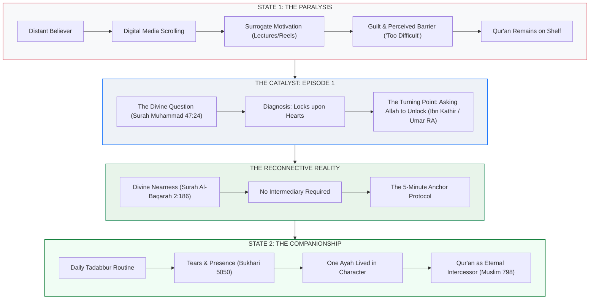

---
artifact:
  artifact_id: QURAN-COMEBACK-MINDMAP-001
  artifact_type: mind_map
  artifact_version: 1.0.0
  project_id: HUURS-QURAN
  campaign_id: COME-BACK-TO-QURAN
  title: "Episode 1 Knowledge Visualization: The Architecture of Return"
  description: "Conceptual knowledge graph, visual cognitive hierarchy, and Mermaid structural maps illustrating the journey from spiritual paralysis to living companionship with the Qur'an."
  topic: "Knowledge Visualization & Cognitive Architecture"
  language: en-US
  audience: "Visual learners, content writers, video storytellers, and curriculum designers"

provenance:
  parent_artifacts:
    - "file:///mnt/AI/ag/Campaign/01_RESEARCH/QURAN-COMEBACK-THEMES-001.md"
    - "file:///mnt/AI/ag/Campaign/06_TADABBUR/QURAN-COMEBACK-TADABBUR-001.md"

lifecycle:
  status: approved
  created_by: AGENT-06
  created_at: 2026-09-07T16:24:00Z
  updated_at: 2026-09-07T16:24:00Z

verification:
  verification_status: verified
  verified_by: AGENT-03
  qa_status: passed
  human_review_status: approved

storage:
  repository: huurs-studio
  path: 07_MINDMAP/
  filename: QURAN-COMEBACK-MINDMAP-001.md
---

# Episode 1 Knowledge Visualization: The Architecture of Return (`QURAN-COMEBACK-MINDMAP-001`)

**Campaign:** Come Back to the Qur'an  
**Module:** Episode 1 — *The Anatomy of Returning*  
**Assigned Agent:** `AGENT-06` (Knowledge Visualization Agent)  
**Parent Artifact:** `QURAN-COMEBACK-THEMES-001`  

---

## 1. High-Level Cognitive Architecture



---

## 2. The Five-Tier Hermeneutical Ladder

This structural hierarchy establishes the exact cognitive path through which every verse is processed before reaching audience reflection:

```text
TIER 1: REVELATION (Tanzil)
└── Exact Arabic Uthmani Text (47:24)
      │
TIER 2: TRANSLATION (Tarjamah)
└── Clear, faithful modern English (Dr. Mustafa Khattab)
      │
TIER 3: CLASSICAL CONTEXT (Tafsir & Asbab)
└── Ibn Kathir & Ma'arif-ul-Qur'an (Lexical d-b-r, Umar's athar)
      │
TIER 4: CONTEMPLATION (Tadabbur)
└── Self-audit: Examining personal locks, heedlessness, and distractions
      │
TIER 5: APPLICATION ('Amal)
└── Concrete implementation: The 5-Minute nightly anchor protocol
```

---

## 3. Cognitive Contrast Map: Passive Consumer vs. Qur'anic Companion

| Dimension | The Passive Consumer (Current State) | The Qur'an Companion (Target State) |
|---|---|---|
| **Primary Medium** | Algorithmic social media feeds & commentary | Physical/digital Mushaf in quiet contemplation |
| **Pacing** | Fast, fragmented, multi-tabbed (15–30 sec) | Slow, rhythmic, breathing with the verse (5 min) |
| **Emotional Response** | Ephemeral surge of emotion followed by inertia | Deep, quiet remorse, awe, and weeping (Bukhari 5050) |
| **Action Orientation** | Shares video to friends without personal change | Selects one ayah and adjusts speech, character, or dua |
| **Mindset Toward Text** | "The Qur'an is an ancient academic code." | "The Qur'an is Allah speaking directly to my reality today." |

