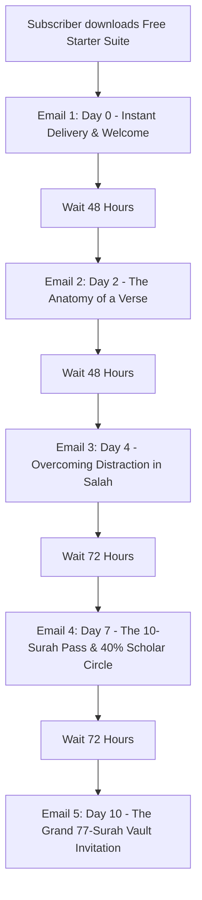

# Huurs Studio 5-Part Automated Email Nurture Sequence

**Goal:** Welcome new subscribers who downloaded the Free 3-Surah Starter Suite, establish genuine spiritual trust, teach them how to use cartographic exegesis, and introduce them to the 10-Surah Custom Pass ($6.99) and Complete 77-Surah Master Vault ($15.00).  
**Tone:** Serene, contemplative, scholarly, deeply respectful, zero fake hype, zero artificial timers.

---

## Sequence Architecture Overview



---

## Email 1 (Day 0 — Sent Immediately Upon Opt-in)

- **Trigger:** Download of `PACKAGE_01_FREE_STARTER_SUITE.zip`
- **Subject Line:** Your 3-Surah Starter Suite is inside (+ a quiet moment)
- **Alternative Subject:** Welcome to Huurs: Al-Fatihah, Al-Kahf & Al-Mulk downloads
- **Preview Text:** Open your widescreen compendiums and begin your contemplation.

### Email Body:
```text
As-salamu 'alaykum wa rahmatullah,

Welcome to Huurs Studio.

Your Free 3-Surah Starter Suite is ready for you to download below:

👉 [Download Your Free 3-Surah Starter Suite (ZIP)]
(Includes Surah Al-Fatihah, Surah Al-Kahf, and Surah Al-Mulk)

What you have received is not a collection of quick quote cards or condensed summaries. You have received the complete 9-layer academic and cartographic system for three foundational Surahs:

1. Surah Al-Fatihah (The Opening): The Seven Oft-Repeated Verses mapped across the divine dialogue of prayer.
2. Surah Al-Kahf (The Cave): The Four Trials of Man (Faith, Wealth, Knowledge, Power) and the spiritual fortress of Friday.
3. Surah Al-Mulk (The Dominion): The 30-verse salvific shield against the trial of the grave.

Each Surah contains:
• 10-Plate Widescreen Compendium PDF (16:9 Landscape)
• Offline Interactive Digital Suite with real-time node search
• Vector Mindmap HTML and PDF
• Verified Classical Sunni Exegesis (Tafsir al-Tabari, Ibn Kathir, Al-Qurtubi)
• Structured Tadabbur Contemplation Guide

HOW TO BEGIN TODAY (5 MINUTES):
Do not try to read everything at once. This evening, after Maghrib or Isha:
1. Open the Interactive Digital Suite for Surah Al-Fatihah in any browser.
2. Spend just three uninterrupted minutes exploring Plate 1 (The Liturgical Inception).
3. Read the authentic Hadith Qudsi regarding the halved prayer.

May Allah place tranquility and enduring Barakah in your heart through His words.

With peace and reflection,
The Huurs Studio Team
READ. REFLECT. RETURN.

P.S. Everything in this starter suite is 100% free and open-access as a continuous Waqf. You are welcome to share the PDFs with family and students of knowledge.
```

---

## Email 2 (Day 2 — 48 Hours Later)

- **Subject Line:** The architecture of a verse (why we struggle to remember)
- **Alternative Subject:** How visual cartography changes the way you read the Qur'an
- **Preview Text:** When you can see the structural symmetry, contemplation becomes effortless.

### Email Body:
```text
As-salamu 'alaykum,

Have you ever read an entire page of the Qur'an, closed the Mushaf, and realized your mind had wandered through half of it?

You are not alone. In our modern world, our minds are bombarded by rapid, fractured digital feeds. When we sit with the Holy Qur'an, we often attempt to read it like a conventional linear novel.

Classical scholars such as Al-Biqa'i (author of Nazm ad-Durar) and Fakhr al-Din al-Razi understood that the Qur'an is not a linear book; it is a divine architectural symmetry:
• Verses connect to previous revelations like keystones in an arch.
• Invocations mirror historical challenges faced by the Prophets.
• Theological themes echo across cosmic and legal dimensions.

When you open the Huurs Vector Mindmaps, you are not looking at decoration. You are looking at structural cartography:
• 16 Pillars per Surah representing major thematic movements.
• 64 Knowledge Nodes identifying authentic historical occasions (Asbab an-Nuzul) and lingual nuances.

TRY THIS REFLECTION EXERCISE:
Open Plate 4 of Surah Al-Kahf in your starter pack. Notice how the parable of the Two Gardens directly balances the story of the Companions of the Cave. Faith under poverty on the left; arrogance under wealth on the right.

Once your eyes witness this harmony, your heart naturally settles into stillness.

Tomorrow, we will explore how this changes your personal Salah.

With warm regards,
Huurs Studio
```

---

## Email 3 (Day 4 — 48 Hours Later)

- **Subject Line:** Restoring presence (Khushu') in your daily prayer
- **Alternative Subject:** Bringing Surah Al-Fatihah alive in every Rak'ah
- **Preview Text:** "I have divided the prayer between Myself and My servant..."

### Email Body:
```text
As-salamu 'alaykum,

In Sahih Muslim, the Prophet Muhammad ﷺ recounted a profound Hadith Qudsi that transforms how one stands in prayer:

Allah the Exalted says: 
"I have divided the prayer between Myself and My servant into two halves, and My servant shall have what he asks for."

When the servant says: "Al-hamdu lillahi Rabbi al-'alameen", Allah says: "My servant has praised Me."
When he says: "Ar-Rahmani ar-Rahim", Allah says: "My servant has extolled Me."
When he says: "Maliki Yawmi ad-Deen", Allah says: "My servant has glorified Me."

Yet how often do we rush through these words without realizing that the Lord of the Worlds is responding to us directly after each Ayah?

In the Surah Al-Fatihah Interactive Suite included in your starter pack, click on the "Asbab & Context" badge on Plate 1. Notice how the classical commentators detail this reciprocal communion.

When you stand for prayer tonight, pause for two seconds after each verse. Allow the silence to echo with the reality of Allah's reply.

Presence (Khushu') is not an accident. It is cultivated through knowledge and tranquility.

Peace be upon you,
Huurs Studio
```

---

## Email 4 (Day 7 — 72 Hours Later)

- **Subject Line:** Introducing the 10-Surah Custom Study Pass (40% Off)
- **Alternative Subject:** Study the Surahs that speak to your current season of life
- **Preview Text:** Hand-select any 10 Surahs from our verified 77-Surah collection.

### Email Body:
```text
As-salamu 'alaykum,

Over the past week, you have explored the foundational gateways: Al-Fatihah, Al-Kahf, and Al-Mulk.

Every believer walks through different seasons:
• Some seasons require the grief-stricken solace of Surah Yusuf and Maryam.
• Other seasons require the fiery steadfastness of Surah Hud and Al-Anbiya.
• Other seasons demand the ethical and social guidelines of Surah An-Nur and Al-Hujurat.

To allow you to tailor your studies without having to purchase an entire institutional archive, we created the:

👉 [10-Surah Custom Study Pass ($6.99 flat)]
(Automatic 40% Scholar Circle discount applied)

With this pass, you choose ANY 10 Surahs from our 77-Surah Pre-Juz 'Amma collection (Juz 1 through 29):

POPULAR 10-SURAH COMBINATIONS:
1. The Night Solace & Vigil Pack:
   Ya-Sin, Al-Waqi'ah, Al-Muzzammil, Al-Insan, Maryam, Ta-Ha, Qaf, Ar-Rahman, Al-Hadid, As-Sajdah.
2. The Family, Law & Community Pack:
   Al-Hujurat, An-Nur, An-Nisa, At-Talaq, At-Tahrim, Al-Jumu'ah, Al-Munafiqun, Al-Mujadilah, Al-Mumtahanah, As-Saff.
3. The Prophetic Crucible Pack:
   Yusuf, Hud, Ibrahim, Al-Anbiya, Al-Qasas, Ash-Shu'ara, Nuh, Yunus, Sad, Ta-Ha.

EACH SURAH DELIVERS:
• Complete 10-Plate Master Compendium PDF (16:9 Landscape)
• Offline Interactive Digital Suite with real-time search & modal investigations
• Vector Mindmap HTML and PDF
• Sunni Tafsir & Tadabbur Monographs

Regular individual value: ~$25.00 to $35.00.
With the 10-Surah Custom Pass: just $6.99 (40% OFF).

Protected by direct ownership: Zero DRM locks. Unlimited personal and family offline use across all your devices.

👉 [Claim Your 10-Surah Custom Pass for $6.99]

With sincerity,
Huurs Studio
```

---

## Email 5 (Day 10 — 72 Hours Later)

- **Subject Line:** The complete 77-Surah Digital Vault (and 7 Master Omnibuses)
- **Alternative Subject:** An entire digital Islamic library on your personal device
- **Preview Text:** 77 Surahs, 860 widescreen pages, 4 Thematic Anthologies, lifetime access.

### Email Body:
```text
As-salamu 'alaykum,

Imagine having the definitive cartographic knowledge system of the Holy Qur'an with you wherever you go:
• On your laptop in quiet morning study sessions.
• On your tablet during family Halaqahs.
• On your desktop while preparing a lecture, class, or Friday Khutbah.

The 77-Surah Master Digital Vault is now complete, covering from Surah Al-Fatihah through Surah Al-Mursalat (over 91% of the entire Qur'anic text).

WHAT IS INSIDE THE COMPLETE VAULT:
1. All 77 Master Compendium PDFs (770+ widescreen vector plates)
2. All 77 Offline Interactive Digital Suites (HTML web applications operable without internet)
3. 7 Curated Master Omnibus Compendiums (860 total pages in single unified PDFs)
4. 4 Master Cross-Surah Thematic Anthologies (Prophetic Du'as, Cosmic Signs, Patience & Resilience, and the Heart)
5. 8 Canonical Asbab Nuzul Scholarly Volumes authenticated from Kutub as-Sittah Hadith sources
6. Universal Offline Portal Browser (index.html) with real-time search and filter tools

THE PRICING REALITY:
If purchased individually à la carte, the 77 Surahs total $206.76.
The complete Master Vault is available for a one-time investment of $15.00 (over 68% off).

Zero subscriptions. Zero DRM locks. 100% offline ownership forever.

👉 [Explore the Complete 77-Surah Master Digital Vault ($15.00)]

Whether you continue studying through our free open-access gateway, pick your favorite 10 Surahs, or enter the complete vault, we pray Allah makes His Book the spring of your heart.

With gratitude and prayers,
Huurs Studio
READ. REFLECT. RETURN.
```
