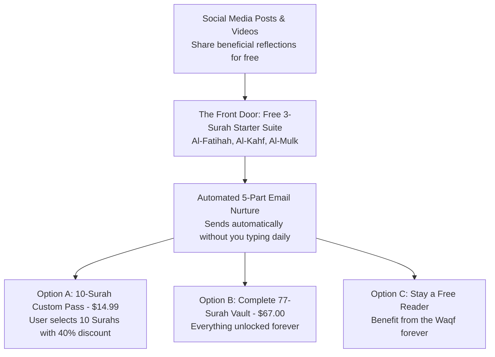

# The Newbie's Complete Guide to Launching the Huurs Studio Campaign
## How to Launch, Share, and Sell Without Any Prior Marketing Experience

Welcome! If you have **never sold anything online**, **never run an email campaign**, and **never built a social media following**, this document was written specifically for you.

You do not need to be a marketing guru. You do not need to use pushy sales tactics or aggressive countdown timers. In Islamic entrepreneurship, our job is simply to **create immense value, verify our scholarship, share beneficial knowledge generously, and let Allah place the Barakah**.

---

## 1. The Big Picture: How This Actually Works

Think of your online project as a welcoming traditional courtyard:

1. **Step 1 (The Invitation):** You post beneficial Quranic reflections on Instagram, X, YouTube, or TikTok.
2. **Step 2 (The Gift):** You offer the **Free 3-Surah Starter Suite** (Al-Fatihah, Al-Kahf, Al-Mulk). When someone wants it, they enter their email.
3. **Step 3 (The Relationship):** An automated system sends them 5 thoughtful emails over 10 days, teaching them how to reflect and pray with presence.
4. **Step 4 (The Fair Offer):** Inside those emails, people learn about the **10-Surah Custom Pass ($14.99)** and the **Complete 77-Surah Vault ($67.00)**. Many will happily purchase to support the work and deepen their study.

---

## 2. Step-by-Step Technical Setup (Takes Under 45 Minutes)

You only need **two free tools** to run this entire business:

### Tool A: Gumroad (For Taking Payments & Hosting Downloads)
* **Cost:** 100% free to start (Gumroad only takes a fee when you make a sale).
* **What to do:**
  1. Go to [gumroad.com](https://gumroad.com) and create an account.
  2. Click **"New Product"** &rarr; Select **"Digital Product"**.
  3. **Product 1 (The Free Starter Suite):**
     * Name: `The Quranic Gateway: 3 Essential Surahs (Al-Fatihah, Al-Kahf & Al-Mulk)`
     * Price: `$0.00`
     * Upload File: `12_PRODUCTS/bundles/PACKAGE_01_FREE_STARTER_SUITE.zip`
     * Copy-paste the description from [`12_PRODUCTS/store/77_SURAHS_STORE_LISTINGS.md`](file:///mnt/AI/ag/Campaign/12_PRODUCTS/store/77_SURAHS_STORE_LISTINGS.md).
  4. **Product 2 (The 10-Surah Custom Pass):**
     * Name: `The Scholar's Choice: 10-Surah Custom Quranic Study Pass`
     * Price: `$14.99`
     * Copy-paste the description from `12_PRODUCTS/store/77_SURAHS_STORE_LISTINGS.md`.
  5. **Product 3 (The Complete 77-Surah Master Vault):**
     * Name: `The Grand Quranic Cartography: 77-Surah Master Digital Vault`
     * Price: `$67.00`
     * Upload File: `12_PRODUCTS/bundles/PACKAGE_04_77_SURAHS_MASTER_VAULT.zip`

### Tool B: ConvertKit / Kit or MailerLite (For Automated Emails)
* **Cost:** Free for up to 1,000 subscribers.
* **What to do:**
  1. Create an account on [kit.com](https://kit.com) or [mailerlite.com](https://mailerlite.com).
  2. Click **"Automations"** or **"Sequences"** &rarr; Click **"New Sequence"**.
  3. Copy and paste the 5 emails directly from [`15_MARKETING/01_EMAIL_NURTURE_SEQUENCE_5_PARTS.md`](file:///mnt/AI/ag/Campaign/15_MARKETING/01_EMAIL_NURTURE_SEQUENCE_5_PARTS.md).
  4. Set the timing delays:
     * Email 1: Send immediately.
     * Email 2: Wait 2 days.
     * Email 3: Wait 2 days.
     * Email 4: Wait 3 days.
     * Email 5: Wait 3 days.
  5. In Email 1, replace the link placeholder with your Gumroad link for Product 1.
  6. In Emails 4 and 5, replace the link placeholders with your Gumroad links for the $14.99 Pass and the $67 Vault.

*That's it! Your entire automated sales engine is now alive.*

---

## 3. How to Post on Social Media (Without Being an Influencer)

You do not need to show your face or record your voice if you don't want to. Our entire **Huurs Visual DNA** is based on:
`NATURE + KNOWLEDGE + REFLECTION + TRANQUILITY`

### The Golden Rule: "Teach, Don't Pitch"
* If you post: *"Buy my $14.99 Quran study pack!"*, people will scroll past.
* If you post: *"Why did the Prophet ﷺ pause after every verse of Surah Al-Fatihah? Here is the Hadith Qudsi that changes your Salah..."*, thousands of Muslims will read, bookmark, share, and want to learn more.

### Choose Just TWO Platforms to Start:
1. **Instagram:** Best for visual carousels (slides).
2. **X (Twitter) or YouTube:** Best for reflective threads and long-form community posts.

### Where to Find What to Post:
Open [`14_SOCIAL/01_LAUNCH_CAMPAIGN_SOCIAL_PACK.md`](file:///mnt/AI/ag/Campaign/14_SOCIAL/01_LAUNCH_CAMPAIGN_SOCIAL_PACK.md).
It contains 30 days of ready-to-copy posts:
* **Carousel 1:** The 4 Hidden Trials of Surah Al-Kahf (Slides 1–10 written out).
* **Thread 1:** The Divine Dialogue of Surah Al-Fatihah (7 tweets ready to copy-paste).
* **Short Video Script 1:** The 30 Seconds That Transform Your Fatihah.

---

## 4. How to Create Visuals Easily (In 5 Minutes)

You already have the visual assets right here on your computer!
1. **Take Screenshots of Your Vector Mindmaps:**
   * Open `07_MINDMAP/FATIHAH_MASTER_MINDMAP.html` or `07_MINDMAP/KAHF_MASTER_MINDMAP.html` in your browser.
   * Take clean screenshots of the beautiful dark-and-gold cards.
2. **Use Free Stock Nature Footage:**
   * Go to [pexels.com](https://pexels.com) or [unsplash.com](https://unsplash.com).
   * Search for: *"ocean waves"*, *"misty mountain forest"*, *"starry night sky"*, *"gentle stream"*.
   * Download a 10-second vertical video.
   * Overlay the text from our short video scripts using free apps like **CapCut** or **Canva**.

---

## 5. The 15-Minute Daily Routine Checklist

You do not need hours every day. Follow this exact 15-minute routine:

- [ ] **Minute 0–5:** Open [`14_SOCIAL/01_LAUNCH_CAMPAIGN_SOCIAL_PACK.md`](file:///mnt/AI/ag/Campaign/14_SOCIAL/01_LAUNCH_CAMPAIGN_SOCIAL_PACK.md). Copy the post for today and schedule it or post it to your account.
- [ ] **Minute 5–10:** Check your comments or direct messages. Reply to any questions with gentle, polite Islamic etiquette (*Adab*).
- [ ] **Minute 10–15:** Check Gumroad to see new free downloads or sales. Send a quiet Du'a for each person who downloaded the files.

---

## 6. Overcoming Common Beginner Fears

### "What if nobody buys at first?"
* This is completely normal. Focus on getting your first **50 free downloads**. When 50 people download your free starter suite, your automated emails will take care of the rest. Even a 2%–4% conversion rate means your first sales will happen naturally without pressure.

### "Is it permissible to charge for Quranic educational materials?"
* Classical Sunni scholars across all four schools of jurisprudence agree that taking remuneration for publishing, authoring educational guides, cartography, and teaching is completely permissible (*Ja'iz*).
* Furthermore, by offering **Al-Fatihah, Al-Kahf, and Al-Mulk 100% free forever**, you are providing immense open-access Waqf for the Ummah.

### "What if someone wants a refund?"
* Honor our **100% Barakah Guarantee**. If anyone asks for a refund within 30 days, immediately issue a full, polite refund without argument. In Islamic business, generosity with buyers attracts divine Barakah.

---

## 7. Quick Reference: Key Files You Own

| File | What It Is | Where It Lives |
|---|---|---|
| **Master Newbie Guide** | This document | [`newbiecampaign.md`](file:///mnt/AI/ag/Campaign/newbiecampaign.md) |
| **5-Part Email Sequence** | Ready-to-copy automated emails | [`15_MARKETING/01_EMAIL_NURTURE_SEQUENCE_5_PARTS.md`](file:///mnt/AI/ag/Campaign/15_MARKETING/01_EMAIL_NURTURE_SEQUENCE_5_PARTS.md) |
| **Landing Page Copy** | Free opt-in page words | [`15_MARKETING/02_LEAD_MAGNET_LANDING_PAGE_COPY.md`](file:///mnt/AI/ag/Campaign/15_MARKETING/02_LEAD_MAGNET_LANDING_PAGE_COPY.md) |
| **30-Day Social Media Pack** | Copy-paste carousels, threads & scripts | [`14_SOCIAL/01_LAUNCH_CAMPAIGN_SOCIAL_PACK.md`](file:///mnt/AI/ag/Campaign/14_SOCIAL/01_LAUNCH_CAMPAIGN_SOCIAL_PACK.md) |
| **Storefront Sales Copy** | Gumroad listing text | [`12_PRODUCTS/store/77_SURAHS_STORE_LISTINGS.md`](file:///mnt/AI/ag/Campaign/12_PRODUCTS/store/77_SURAHS_STORE_LISTINGS.md) |
| **Master Product Catalog** | Full inventory of all 77 Surahs | [`12_PRODUCTS/00_MASTER_PRODUCT_CATALOG.md`](file:///mnt/AI/ag/Campaign/12_PRODUCTS/00_MASTER_PRODUCT_CATALOG.md) |
